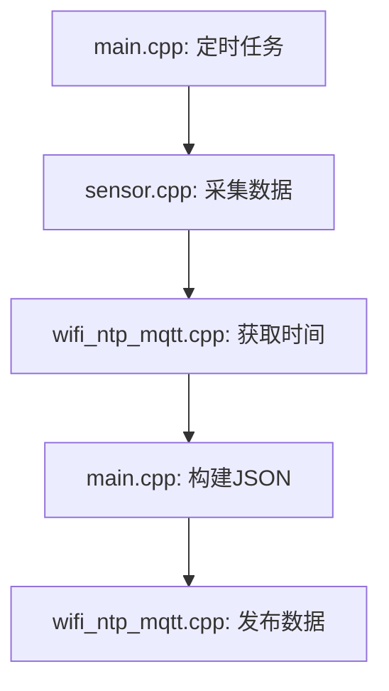

# 架构文档 (arch.md)

## 1. 项目概述
本项目是一个基于 ESP32 的 Arduino 固件，主要用于传感器数据采集、WiFi/NTP 时间同步、MQTT 数据传输以及日志管理。

## 2. 模块划分

### 2.1 主模块 (main.cpp)
- **功能**: 负责初始化各模块、调度任务、处理命令队列。
- **依赖模块**: `config_manager`, `wifi_ntp_mqtt`, `sensor`, `log_manager`.

### 2.2 配置管理 (config_manager.h/cpp)
- **功能**: 管理 WiFi、MQTT、NTP 等配置信息。
- **数据结构**: `AppConfig` 结构体存储配置参数。

### 2.3 WiFi/NTP/MQTT (wifi_ntp_mqtt.h/cpp)
- **功能**:
  - WiFi 连接与维护。
  - NTP 时间同步。
  - MQTT 客户端连接与数据传输。

### 2.4 传感器模块 (sensor.h/cpp)
- **功能**:
  - 温度传感器初始化与数据采集。
  - 加热器与曝气控制。

### 2.5 日志管理 (log_manager.h/cpp)
- **功能**:
  - 日志系统初始化。
  - 日志级别定义与日志记录。

## 3. 数据流
1. **初始化阶段**:
   - 加载配置 (`config_manager`)。
   - 初始化日志系统 (`log_manager`)。
   - 连接 WiFi/NTP (`wifi_ntp_mqtt`)。
   - 初始化传感器 (`sensor`)。

2. **运行阶段**:
   - 定期采集传感器数据 (`sensor`)。
   - 通过 MQTT 发布数据 (`wifi_ntp_mqtt`)。
   - 记录运行日志 (`log_manager`)。

## 4. 数据上传与接收
### 4.1 数据上传
#### 发布流程
1. **数据准备**:
   - 传感器数据采集（`sensor.cpp` 中的 `readTempIn()` 和 `readTempOut()`）。
   - 时间戳生成（`wifi_ntp_mqtt.cpp` 中的 `getTimeString()`）。
2. **JSON 序列化**:
   - 使用 `ArduinoJson` 库构建 JSON 对象（`main.cpp` 中的 `buildSensorPayload()`）。
   - 字段说明:
     - `tempIn`: 内部温度（浮点数）。
     - `tempOut`: 外部温度数组（最多 3 个值）。
     - `timestamp`: ISO 8601 格式时间字符串。
3. **MQTT 发布**:
   - 主题: 动态配置（`config_manager.cpp` 中的 `mqttPostTopic`）。
   - QoS: 1（至少一次交付）。
   - 超时: 默认 5 秒（`wifi_ntp_mqtt.cpp` 中的 `publishData()`）。

#### 代码调用链

### 4.2 数据接收
#### 订阅流程
1. **初始化订阅**:
   - 启动时自动订阅 `mqttResponseTopic`（`wifi_ntp_mqtt.cpp` 中的 `connectToMQTT()`）。
2. **消息处理**:
   - 回调函数解析 JSON（`main.cpp` 中的 `handleCommand()`）。
   - 支持命令类型:
     - `heater`: 控制加热器开关（GPIO25）。
     - `aeration`: 设置曝气时长（秒）。
3. **状态同步**:
   - 执行命令后通过 `mqttPostTopic` 返回确认消息。

#### 消息协议
| 字段       | 类型   | 必填 | 说明                  |
|------------|--------|------|-----------------------|
| `cmd`      | string | 是   | 命令类型              |
| `value`    | any    | 否   | 开关状态（on/off）    |
| `duration` | int    | 否   | 持续时间（毫秒）      |
| `schedule` | string | 否   | 定时任务（yyyy-MM-DD HH:mm:ss） |

### 4.3 错误处理
#### 发布失败
- **重试策略**:
  1. 首次失败: 延迟 1 秒后重试。
  2. 二次失败: 检查 WiFi 连接，延迟 3 秒。
  3. 三次失败: 记录错误日志并进入深度睡眠。
- **日志标记**: 使用 `LOG_ERROR("MQTT publish failed")`。

#### 连接中断
- **自动恢复**:
  - 每 10 秒检查 `client.connected()` 状态。
  - 断开时触发 `reconnect()` 流程（含 WiFi 重连）。
- **离线缓存**: 未实现（需后续优化）。

## 5. 关键依赖
- **ArduinoJson**: 用于 JSON 数据处理。
- **PubSubClient**: MQTT 客户端实现。
- **Preferences**: 用于持久化存储配置。

## 6. 后续优化建议
- 增加配置的动态更新功能。
- 优化 MQTT 断线重连机制。
- 扩展传感器支持类型。